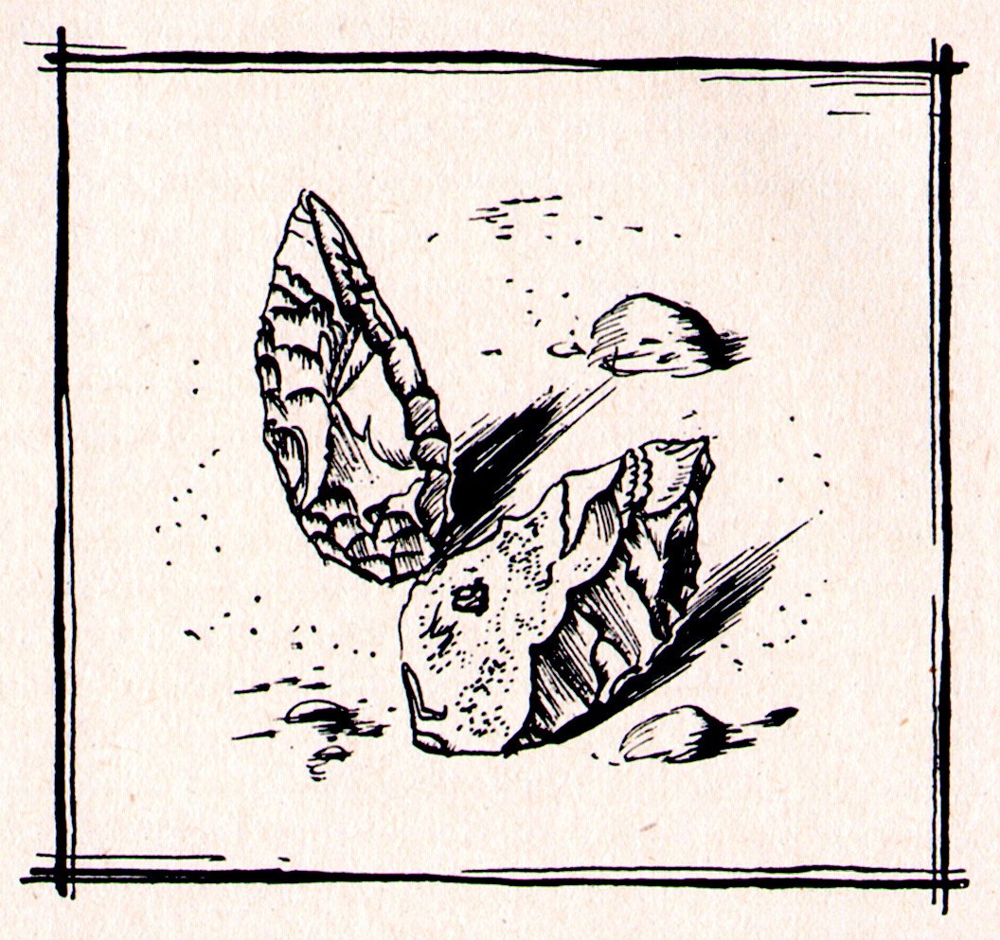

# **mousterian-ux** 


A workspace toolkit for bioinformaticians who move between systems.

Named after the Mousterian stone tools which worked across continents for 300,000 years. This repo will probably need updating next month. But the principle is the same: carry tools that work anywhere.

This repo sets up a productive workspace with one command. It installs what you need, configures what helps, and stays close to defaults so you can feel at home on any Linux machine.


### What is this?

A bootstrap script that turns a fresh Ubuntu install (or an HPC account) into a working environment for computational biology.

It backs up your existing configs, installs useful tools, sets up conda/mamba, and deploys sensible dotfiles. Nothing fancy. Nothing fragile.

**This is not the best setup.** It's *my* setup - an evolutionary bioinformatician who works mostly with genomics. It works well for me. It might work for you. Or it might be a starting point for something better.

Heavily inspired by [Omakub](https://omakub.org/) by DHH, but tilted toward science rather than web development.

**OBS!** This is a work in progress and is not finalized yet.


#### Requirements

- Ubuntu 22.04+ (desktop mode) or any Linux with bash (HPC mode)
- Internet connection
- About 5-25 minutes and a cup of coffee


---

### Quick start and a warning...
There are no current fail safes. No current ways to undo. Read the scripts so you understand what will occur. You do this on your own risk at the moment.
```bash
git clone https://github.com/ndreey/mousterian-ux.git
cd mousterian-ux
bash mousterian-ux.sh
```

Choose your mode when prompted.


---

### Installation modes

| Mode | What it does | Needs sudo? |
|------|--------------|-------------|
| **Fresh Ubuntu** | Full desktop setup with apps, GNOME tweaks, mamba, dotfiles | Yes |
| **HPC environment** | Lightweight setup for clusters — mamba, basic tools, safe dotfiles | No |
| **Dotfiles only** | Just deploy configs, install nothing | No |
| **Check system** | See what you're working with before committing | No |

---

### What gets installed

#### Terminal tools
`tmux` · `tree` · `vim` · `stow` · `pipx` · build essentials

#### Desktop apps (Ubuntu mode)
VS Code · Obsidian · Inkscape · VLC · LibreOffice · Flameshot · LocalSend · Ulauncher · Alacritty

#### Mamba environments for basics
- **cli** — everyday tools (pigz, wget, curl, git)
- **qc** — quality control (pigz, seqkit, bbmap, multiqc, fastqc, samtools, bedtools, bzip2)

#### GNOME tweaks
- Workspace switching with `Super+1/2/3/4/5/6`
- Window moving with `Super+Shift+1/2/3/4/5/6`
- Clean dock, alphabetical app grid
- A few tasteful extensions (blur, space-bar, just-perfection)

---

### Dotfiles included

| Config | What it sets up |
|--------|-----------------|
| alacritty | settings and theme|
| bash | Aliases, history, PATH, prompt |
| git | Name, email, sensible defaults (mine, customize this yourself)|
| vscode | Editor settings, basic vim keybindings, extensions, themes|
| tmux  | Mouse support, some vim-style, windows start from 1, sane defaults (no tpm!)|
| gtk | Theme preferences |
| ulauncher | App launcher settings |

Configs are copied. Not symlinked nor stowed using  `gnu stow`. I just used the word _stow_ as it sounded short and descreptive.

Your old configs are backed up to `~/oldowan-backup/` with a timestamp, just in case...

#### Not your style?

This setup ships with the Vim extension and keybindings loosely inspired by LazyVim/NvChad. It strays from VSCode defaults and has a learning curve (worth learning it).

But if it gets in the way and starts feeling like an escape room you can disable it.

1. Uninstall the Vim extension in VSCode
2. Delete `~/.config/Code/User/keybindings.json`

VSCode falls back to its defaults immediately. No restart needed.

Tmux uses `Ctrl+hjkl` to move between panes instead of the default `Ctrl+b <arrow key>`. To undo that, remove the four `bind -n` lines from `~/.tmux.conf`.

---


### Acknowledgments

This project is inspired by [Omakub](https://omakub.org/), which does something similar for web developers. If you're not doing science, Omakub is probably what you want.


Illustrations are by **Zdenek Burian** from the books "*Great Discoveries*" and "*Life-Blown*" published in 1957 and 1962. All rights remain with the original author(s).


<div align="center">
  
  <br>
  <em>Pack light. Travel far </em>
</div>

---

## More info

### Project structure
```
mousterian-ux/
├── mousterian-ux.sh          # start here
├── init/                     # orchestration scripts
├── install/                  # package installers
│   ├── terminal/             # CLI tools
│   ├── desktop/              # GNOME apps and tweaks
│   └── mamba/                # conda/mamba setup
├── stow/                     # dotfile deployment
├── backup/                   # config backup script
└── dotfiles/                 # the actual configs
    ├── bash/
    ├── git/
    ├── vscode/
    └── ...
```

### Keybindings

##### GNOME

| Key | What it does |
|-----|--------------|
| `Super+1-6` | Switch to workspace 1-6 |
| `Alt+1-9` | Switch to pinned app in dock |
| `Super+w` | Close window |
| `Super+Up` | Maximize window |
| `Super+BackSpace` | Resize window |
| `Shift+F11` | Toggle fullscreen |
| `Super+Space` | Open Ulauncher |
| `Shift+Super+s` | Screenshot with Flameshot (got a dedicated key for this) |

##### Tmux

| Key | What it does |
|-----|--------------|
| `Ctrl+h/j/k/l` | Move between panes (left/down/up/right) |
| `Ctrl+b %` | Split pane vertically |
| `Ctrl+b "` | Split pane horizontally |
| `Ctrl+b c` | New window |
| `Ctrl+b 1-9` | Jump to window by number |
| `Ctrl+b d` | Detach session |

> `Ctrl+l` to clear the terminal is lost in tmux. Use the `clear` command instead.

##### VSCode

All `Space` keybindings only work in Normal mode (not while typing).

| Key | What it does |
|-----|--------------|
| `Ctrl+h/j/k/l` | Move between editor splits |
| `Space Space` | Quick open a file |
| `Space ,` | Show all open editors |
| `Space e` | Toggle file explorer |
| `Tab / Shift+Tab` | Next/previous editor in group |
| `Shift+j/k` | Move line down/up |
| `Space c r` | Rename variable (where supported) |

##### VSCode Vim basics

If you are new to Vim, this is all you need to get started:

| Key | What it does |
|-----|--------------|
| `i` | Enter insert mode (start typing) |
| `Esc` | Go back to normal mode |
| `h/j/k/l` | Move left/down/up/right |
| `w / b` | Jump forward/back by word |
| `dd` | Delete line |
| `yy` | Copy line |
| `p` | Paste |
| `u` | Undo |
| `Ctrl+r` | Redo |
| `v` | Visual select (then move to select, y to copy) |
| `V` | Select whole lines |
| `ggVG` | Select all text |
| `/searchterm` | Search in file |
